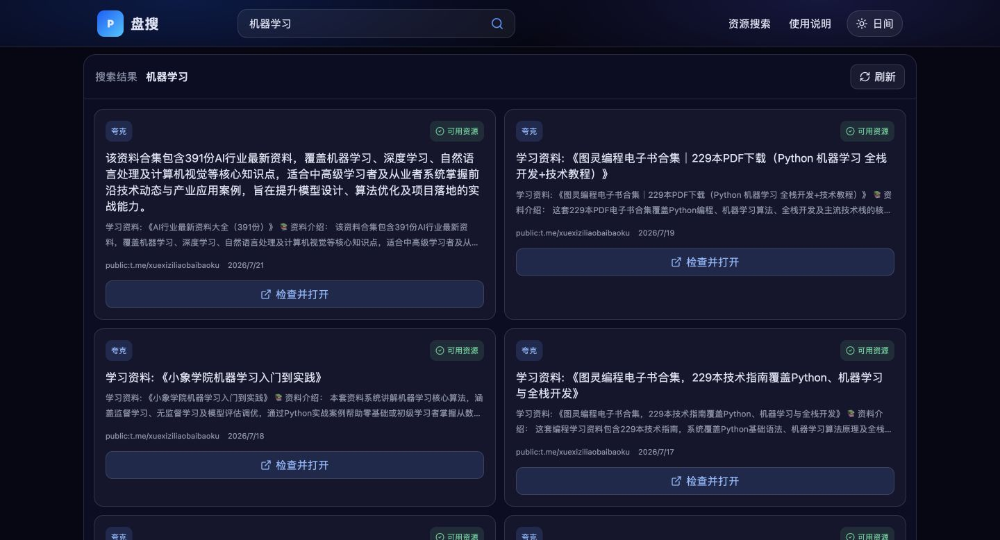
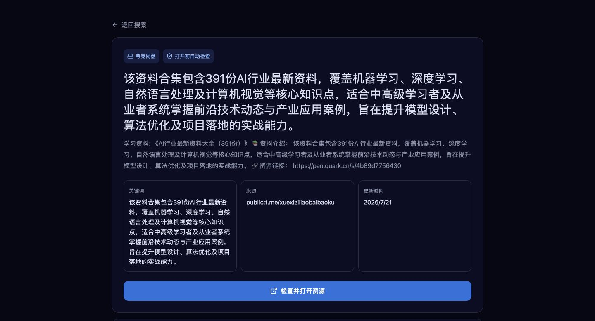

<div align="center">

# 盘搜（PanSou）

聚合公开网盘资源索引，自动检查链接，并优先展示可用结果。

[立即使用](https://panss.dpdns.org/) · [使用指南](https://panss.dpdns.org/guides) · [关于盘搜](https://panss.dpdns.org/about)

</div>


## 盘搜是什么

盘搜是一个面向中文用户的公开网盘资源搜索与链接检查工具。它把分散在公开网页、Telegram 频道和插件数据源中的索引统一整理，在用户搜索时完成聚合、去重与可用性检查，减少反复打开失效链接的时间。

盘搜不上传、不存储资源文件，只展示公开页面中可检索到的索引信息。线上服务地址：

**https://panss.dpdns.org/**

## 使用案例

### 1. 搜索公开学习资料

输入完整名称或主题词，例如“机器学习”。结果页会展示来源、更新时间和资源状态，并把相近结果集中呈现。



### 2. 查看详情并检查链接

进入详情页后可以先核对标题、说明、来源和更新时间，再通过“检查并打开资源”执行打开前验证。



## 为什么使用盘搜

| 能力 | 说明 |
| --- | --- |
| 多来源聚合 | 同时查询本地索引、公开频道和插件来源 |
| 自动去重 | 合并相同或重复的分享链接，减少无效结果 |
| 可用性检查 | 搜索与打开环节检查链接状态，优先展示可用资源 |
| 持续更新 | 后台采集任务持续补充新索引并清理失效内容 |
| 搜索建议 | 支持名称、年份、演员、季数、语言和清晰度等组合关键词 |
| 响应式界面 | 桌面端和移动端均可直接使用，支持日间/夜间模式 |

## 使用方法

1. 打开 [盘搜](https://panss.dpdns.org/)。
2. 输入完整名称；结果不准确时补充年份、版本或清晰度。
3. 选择结果进入详情页，核对来源与更新时间。
4. 点击“检查并打开资源”，以网盘页面的最终状态为准。

## 工作流程

```text
用户搜索
   ↓
本地 SQLite 索引
   ↓
Telegram / 插件 / Web fallback
   ↓
解析、去重、链接验证
   ↓
搜索结果与详情页
   ↓
打开前再次检查
```

## 技术组成

- **API：** FastAPI、SQLAlchemy、SQLite
- **前端：** Next.js 16、React 19、TypeScript
- **采集：** Telegram 公开频道、插件数据源、网页索引 fallback
- **后台任务：** 定时采集、链接验证、存储空间清理、流量报告
- **部署：** Nginx、systemd、HTTPS

## 本地运行

### 后端

```bash
python -m venv .venv
source .venv/bin/activate
pip install -r requirements.txt
cp .env.example .env
python main.py
```

后端默认运行在 `http://localhost:8888`。

### 前端

```bash
cd frontend-clone
npm ci
npm run dev
```

前端开发服务默认运行在 `http://localhost:3000`，通过 `NEXT_PUBLIC_API_BASE_URL` 指向后端。

## 关键配置

| 环境变量 | 用途 |
| --- | --- |
| `PUBLIC_BASE_URL` | 线上服务基础地址 |
| `DATABASE_PATH` | SQLite 数据库路径 |
| `CHANNELS` | 公开 Telegram 频道列表 |
| `VALIDATE_LINKS` | 是否检查分享链接 |
| `QUARK_CLICK_TRANSFER` | 是否启用点击时处理流程 |
| `QUARK_MOCK_TRANSFER` | 本地测试时使用模拟处理 |
| `QUARK_COOKIE` | 真实夸克操作所需 Cookie，禁止提交 |
| `AUTH_ENABLED` | 是否启用受保护接口认证 |
| `WECHAT_TOKEN` | 微信公众号 webhook 验证 Token |

完整示例见 [`.env.example`](.env.example)。

## 常用接口

- `GET /api/health`：服务与采集状态
- `GET /api/search?kw=keyword&res=all`：搜索资源
- `POST /api/search`：提交搜索请求
- `GET /api/resources/{resource_id}`：资源详情
- `POST /api/resources/{resource_id}/open`：检查并打开资源
- `GET /r/{resource_id}`：浏览器友好的等待/跳转入口
- `GET /api/admin/stats`：管理统计
- `POST /wechat`：微信公众号入口

## 验证

```bash
.venv/bin/python -m pytest -q
cd frontend-clone && npm run check
```

搜索召回率可以通过内置基准脚本复测：

```bash
.venv/bin/python scripts/search_benchmark.py \
  --refresh --clear-cache --timeout 8 --max-pages 6 --max-results 8 --concurrency 3
```

## 合规说明

- 本项目只提供公开索引信息，不托管资源文件。
- 请仅搜索和使用有权访问的公开资料，并遵守所在地法律法规及网盘平台规则。
- 公开分享链接可能随时失效，最终可用性以对应网盘页面为准。
- 真实夸克处理依赖非官方 Web API 和 Cookie 鉴权，接口或限流策略变化时可能需要适配。
